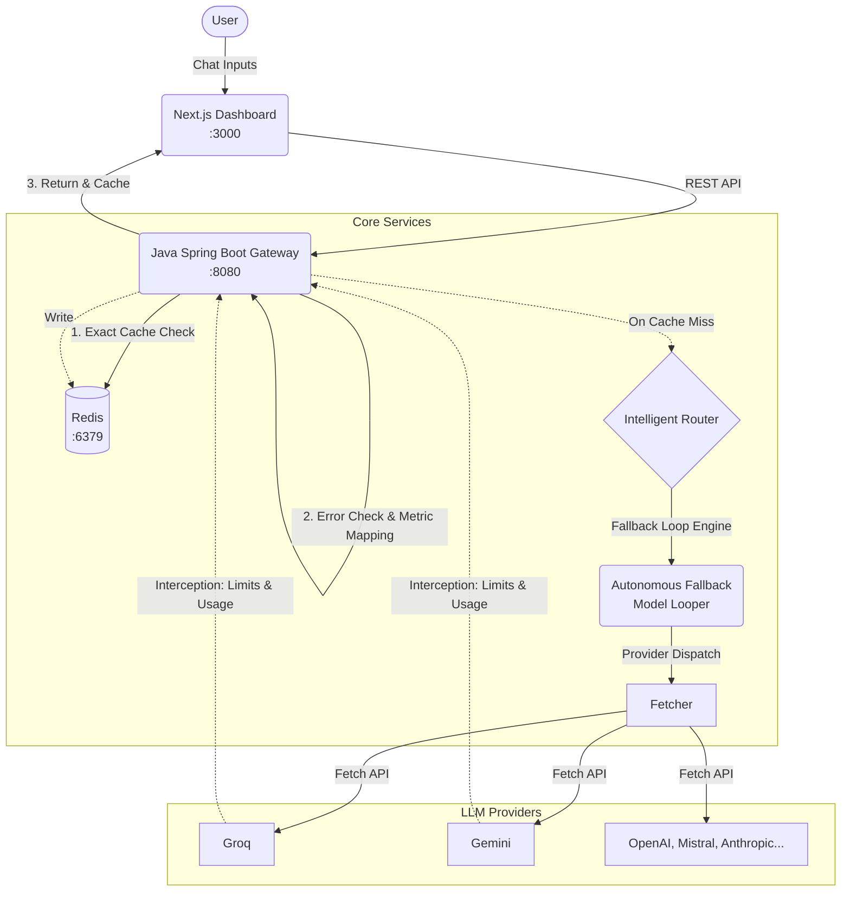

# 🤖 diplomatAI Multi-LLM Gateway


A resilient AI API Gateway that sits between your applications and LLM providers. It intercepts, caches, routes, validates, and fault-tolerates every AI request — so your infrastructure doesn't break when a provider does.

Includes a deeply optimized **3-Pane IDE-Style Dashboard** built in Next.js 15 for API key management, real-time rate limit tracking, and seamless model fallback interactions.

---

## Why?

| Problem | What happens | diplomatAI solution |
|---------|-------------|---------------------|
| **Cost trap** | An agent loops the same question 1,000× — you pay for 1,000 requests | **Semantic Caching** returns identical and similarly-worded prompts instantly at $0 |
| **Rate limit crash** | Provider returns 429 — your system crashes | **Seamless Fallback Engine** traps errors and autonomously loops through priority models to ensure stability |
| **Silent throttling** | API restricts token limits opaquely without alerting you | **Header Interception** tracks real-time limits natively and displays dynamic limit bars directly inside the IDE Dashboard |

---

## Architecture



---

## Supported Providers

| Provider | Free Tier | Validation Endpoint |
|----------|-----------|-------------------|
| OpenAI | $5 credit on sign-up | `api.openai.com/v1/models` |
| Gemini | ✅ 15 RPM free | `generativelanguage.googleapis.com` |
| Anthropic | No free tier | `api.anthropic.com/v1/models` |
| Groq | ✅ 30 RPM free | `api.groq.com/openai/v1/models` |
| Mistral | ✅ Limited free | `api.mistral.ai/v1/models` |
| OpenRouter | ✅ Free models | `openrouter.ai/api/v1/models` |
| Together AI | $5 free credit | `api.together.xyz/v1/models` |

API keys are validated against the provider's real endpoint before dynamic registration.

---

## Quick Start

### Prerequisites
- [Docker & Docker Compose](https://www.docker.com/products/docker-desktop/)
- Git

### Run
```bash
git clone https://github.com/mihir-rathod/diplomatAI.git
cd diplomatAI
docker compose up --build -d
```

### Access
| Service | URL |
|---------|-----|
| Next.js Dashboard | `http://localhost:3000` |
| Gateway API | `http://localhost:8080/api/v1/chat` |
| Redis | `localhost:6379` |

---

## API Reference

### Chat Request (Gateway)
```
POST /api/v1/chat
Body: { "prompt": "your question", "modelId": "auto", "useCache": true }
Returns: { 
  "answer": "...", 
  "metrics": { 
     "cache_hit", "model_routed", "fallback_triggered", 
     "original_model", "rate_limit_max", "rate_limit_remaining", 
     "prompt_tokens", "completion_tokens", "total_tokens"
  } 
}
```

### Register Provider Models
```
POST /api/v1/chat/models
Body: { "provider": "OpenAI", "apiKey": "sk-..." }
Returns: list of dynamically registered routable model configs (or 401 if key is invalid)
```

### Model Registry & Cache Core
```
GET    /api/v1/chat/models/registry          → List all registered active models
DELETE /api/v1/chat/models/registry/{modelId} → Remove a model
DELETE /api/v1/chat/cache                    → Flush Redis Cache
```

### Health & Monitoring
```
GET /api/v1/chat/health  → Gateway status + Redis connectivity
```

---

## Project Structure

```
diplomatAI/
├── dashboard/                  # Multi-LLM Chat UI (Next.js 15, React 19)
│   ├── app/                    # Routing & Resizable Layout
│   ├── components/             # LeftSidebar (History), RightSidebar (API/Metrics), ChatWindow
│   └── public/                 # Assets
├── gateway-service/            # Core Gateway API (Java 25 / Spring Boot 4)
│   ├── src/main/java/com/diplomat/gateway/
│   │   ├── controller/         # REST logic, Fallback routing loops
│   │   ├── client/             # External calls & Deep Header Interception
│   │   ├── service/            # Intelligent routing
│   │   └── config/             # Registry management
│   └── src/main/resources/     
├── docker-compose.yml          # Network & Container orchestration
└── README.md
```

---

## How AI Agents Use This

Change one URL — no SDK, no library, no code rewrite:

```python
# Before: direct to an unreliable provider
response = requests.post("https://api.openai.com/v1/chat/completions", ...)

# After: through diplomatAI Gateway
response = requests.post("http://localhost:8080/api/v1/chat", json={"prompt": "..."})
```

The gateway autonomously handles routing, caching, seamless fallback iteration, and limit tracking instantly.